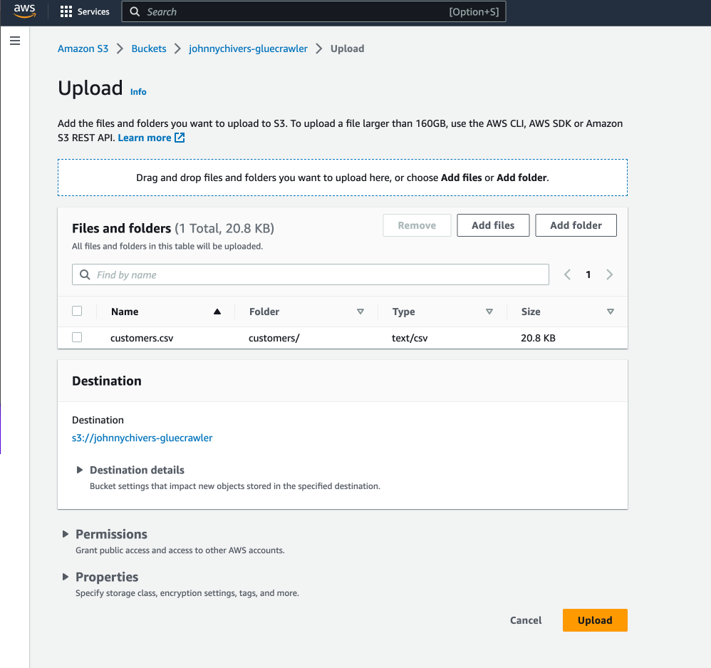
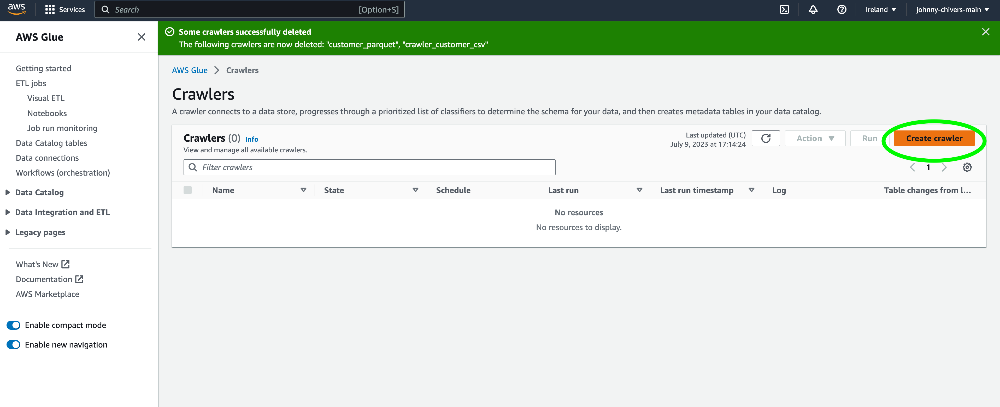
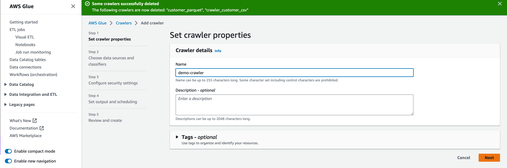
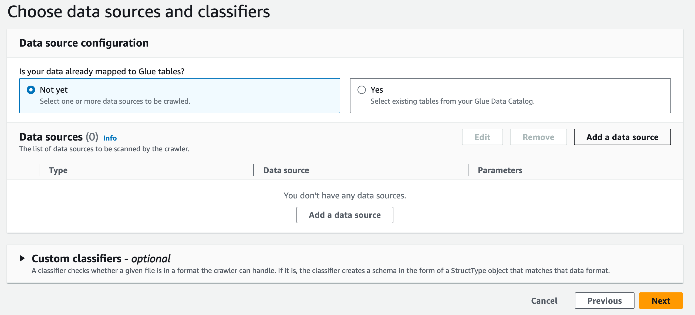
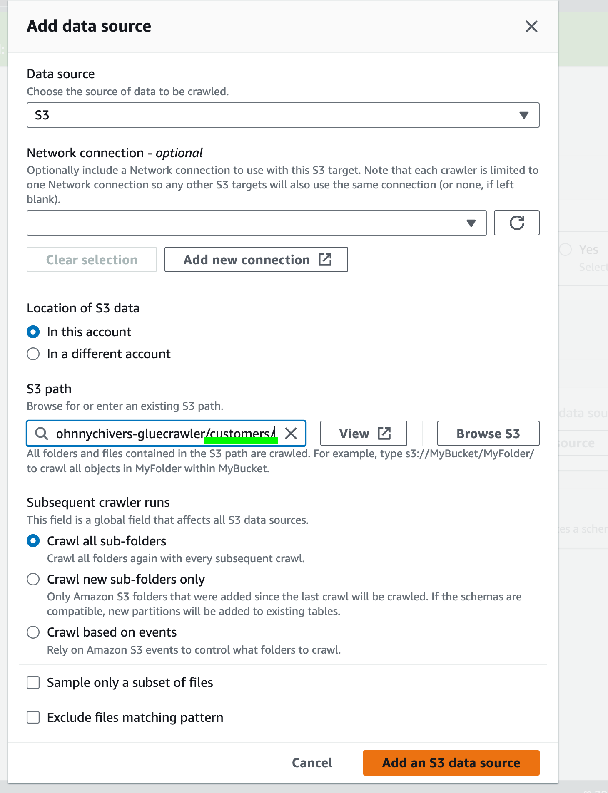
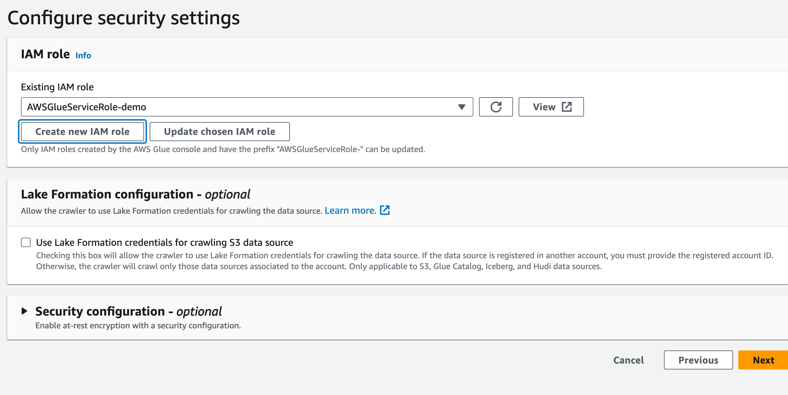
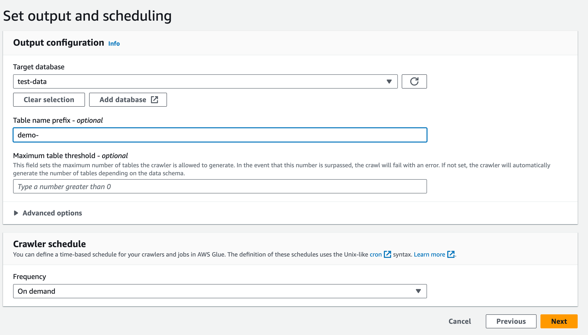

# Gue Cralwers

## Table of contents

- [What's included](#whats-included)
- [Main Tutorial](#main-tutorial)
- [Useful Links](#useful-link)
- [Creators](#creators)

## What's included

The repo is to supplement the [youtube video](https://youtu.be/yb7dAQl1Di8) on AWS Glue. 

You will need an AWS User that has permissions to access S3 and Glue. I am using my Admin account to carry out the tutorial. 

## Data
Below is the schema for the customer table which is created in the Glue Data Catalog by the crawler. The schema also contains some sample data. 

**Customers**
| Customerid      | Firstname | Lastname| Fullname |
| ----------- | ----------- |-----------|-----------|
|  293 | Catherine                | Abel                   | Catherine Abel                 |
|  295 | Kim                      | Abercrombie            | Kim Abercrombie                |
|  297 | Humberto                 | Acevedo                | Humberto Acevedo               |

## Main Tutorial
1. Create S3 bucket 

2. Upload customers folder with data stored in csv. 

3. Create A cralwer 

4. Name Cralwer 

5. Add data source

6. Data Source configuration. 

7. Create new IAM role 

8. Select database

## Creators

**Johnny Chivers**

- <https://github.com/johnny-chivers/>

## Useful Links

- [youtube video](https://youtu.be/yb7dAQl1Di8) 
- [website](https://www.johnnychivers.co.uk)
- [buy me a coffee](https://www.buymeacoffee.com/johnnychivers)

Enjoy :metal:
